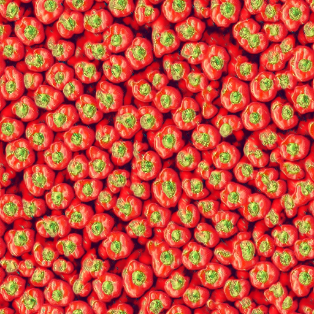
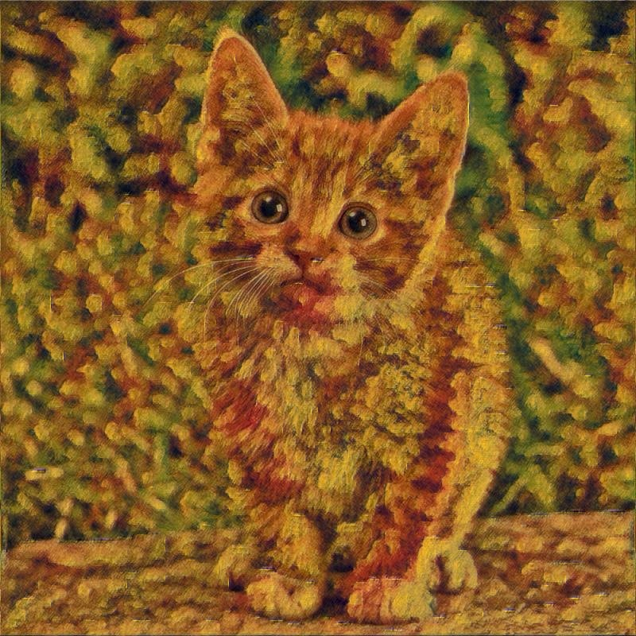

Learn a neural network from one image!

In [our paper](http://arxiv.org/abs/1603.03417) we describe a faster way to generate textures and stylize images. It requires learning a feedforward generator with a loss function proposed by [Gatys et. al.](http://arxiv.org/abs/1505.07376) which takes in our experiments about an hour or two. When the model is trained, a texture sample of any size can be generated instantly.

## Pretrained models
You can find two `iTorch` notebooks as well as 8 pretrained models in `supplementary` directory. You need a GPU (nn.SpatialBatchNormalization throws a error in CPU mode), `torch`, and `iTorch` installed to try them.

## Train texture generator

### Prerequisites
- torch
- cunn
- torch.cudnn (optionally)
- [display](https://github.com/szym/display) (optionally)

Download VGG-19.
```
cd data/pretrained && bash download_models.sh && cd ../..
```

### Train

This command should train a generator close to what is presented in the paper. It is tricky, the variance in the results is rather high, many things lead to degrading (even optimizing for too long time). 
```
th texture_train.lua -texture data/textures/red-peppers256.o.jpg -model_name pyramid -backend nn -num_iterations 1500 -vgg_no_pad -normalize_gradients
```
The generator will fit the texture


And here is a sample of size `512x512` after learning for 700 iterations:




You may also explore other models. We found `pyramid2` requires bigger `learning rate` of about `5e-1`. To prevent degrading noise dimensionality should be increased: `noise_depth 16`. It also converges slower.

This works good for me: 
```
th texture_train.lua -texture data/textures/red-peppers256.o.jpg -gpu 0 -model_name pyramid2 -backend cudnn -num_iterations 1500 -vgg_no_pad -normalize_gradients -learning_rate 5e-1 -noise_depth 16
```

- `vgg_no_pad` corresponds to padding option used in VGG. If set, padding mode = `valid`.

The samples and loss plot will appear at `display` web interface. 

### Sample

A sample from above can be obtained with
```
th texture_sample.lua -model data/out/model.t7 -noise_depth 3 -sample_size 512
```
`noise_depth` should correspond to `noise_depth` used when training.

## Stylization


### Prepare

We used ILSVRC2012 validation set to train a generator. One pass through the data was more than enough for the model described in the paper. 

Extract content from `relu4_2` layer.
```
th scripts/extract4_2.lua -images_path <path/ILSVRC2012>
```
### Train

Use this command to learn a generator to stylize like in the next example.
```
th stylization_train.lua -style_image data/textures/cezanne.jpg -train_hdf5 <path/to/generated/hdf5> -noise_depth 3 -model_name pyramid -normalize_gradients -train_images_path <path/to/ILSVRC2012> -content_weight 0.8

```
### Process
TODO

### Example




#### Variations
We were not able to archive similar results to original parer of L. Gatys on artistic style, which is partially explained by balance problem (read the paper for the details). Yet, while not transferring the style exactly as expected, models produce nice pictures. We tried several hacks to redefine the objective function, which could be more suitable for convolutional parametric generator, none of them worked considerably better, but the results were nice.

For the next pair we used a generator, trained using 16 images only. It is funny, that it did not overfit. Also, in this setting the net does not degrade for much longer time if zero padding is used. Note that, tiger image was not in the train set. 


Using "Starry night" by Van Gogh. It takes about quarter of second to process an image at `1024 x 768` resolution. 


In one of the experiments the generator failed to learn Van Gogh, but went very stylish.


This model tried to fit both texture and content losses on a fixed set of 16 images and only content loss on the big number of images. 


# Hardware
- The code was tested with 12GB NVIDIA Tesla K40m GPU and Ubuntu 14.04. 
- You may decrease `batch_size`, `image_size`, `noise_depth` if the model do not fit your GPU memory.
- `pyramid2` is much more memory efficient than `pyramid`, more, you can decrease the number of filters in there.
- The pretrained models do not need much memory to sample.

# Credits

The code is based on [Justin Johnsons great code](https://github.com/jcjohnson/neural-style) for artistic style. 

The work was supported by Yandex.